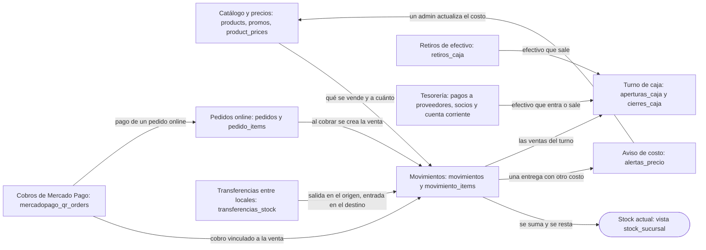
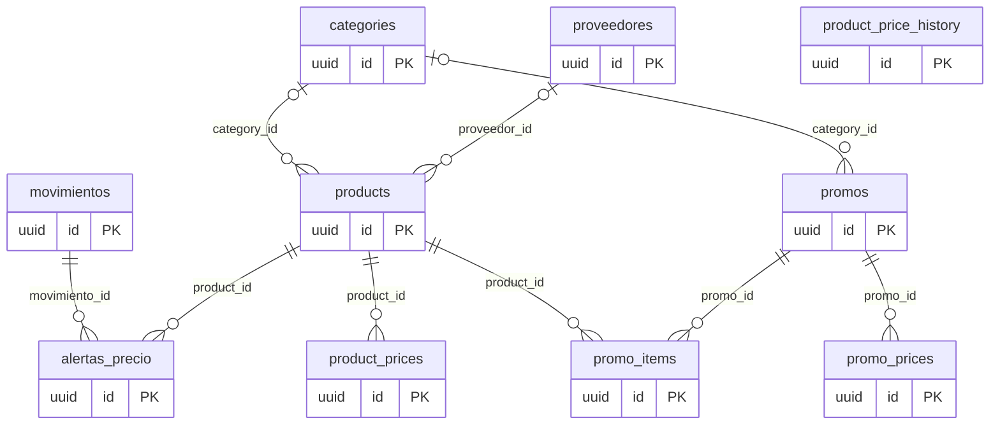
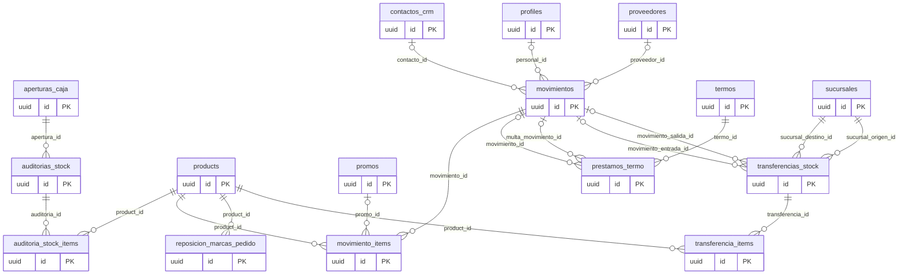
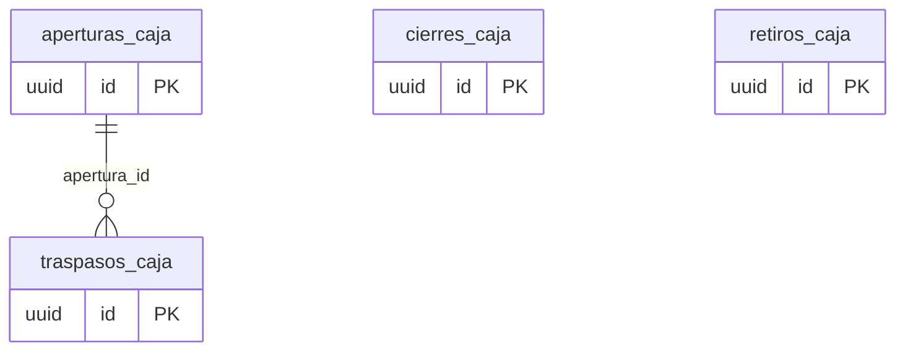
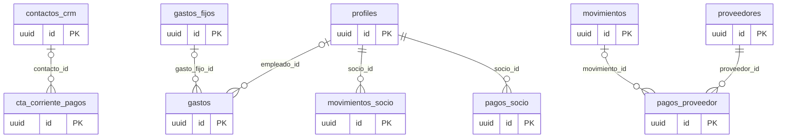
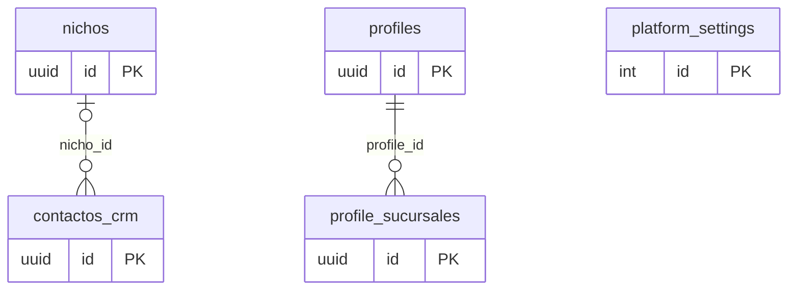
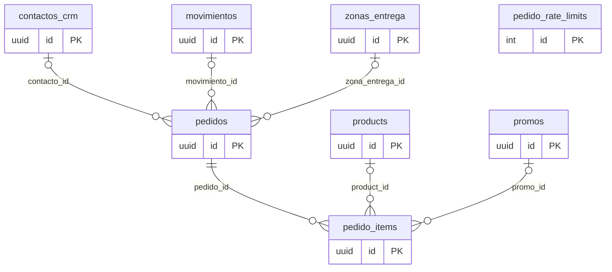
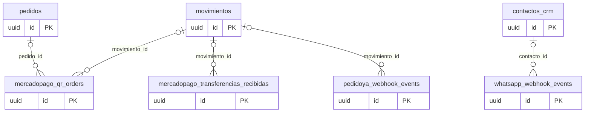

# Base de datos de Kioscos IDEIA: mapa legible

> Generado por `scripts/mapa-base/generar.js` a partir de una instantánea de la base viva (`catalog.json`, 2026-09-19) y de las descripciones escritas a mano (`descripciones.js`). **No se edita a mano**: se corrigen esos dos archivos y se vuelve a generar. Si este documento contradice a la base, gana la base. Cómo actualizarlo, al final.

Son **43 tablas y vistas**, **119 relaciones** (claves foráneas) y 7 dominios. Este documento explica qué significa cada cosa; para el detalle de cómo se usa desde la aplicación, ver [architecture.md](architecture.md) y [requirements.md](requirements.md).

## Ideas clave para leer la base

- **El stock no se guarda en ningún lado.** Se calcula sumando los movimientos: las entregas y los ajustes suman; las ventas, devoluciones y mermas restan; lo anulado no cuenta. La "tabla" stock_sucursal es una vista (una consulta guardada), no datos.
- **Una venta ES un movimiento.** movimientos es la cabecera de todo lo que mueve stock o plata: venta, entrega, devolución, ajuste, merma y las dos puntas de una transferencia. Sus líneas (producto, cantidad, precio) están en movimiento_items.
- **Nada se borra: se anula.** Las ventas y transferencias equivocadas se marcan con anulado_en (quién, cuándo y por qué) y dejan de contar en stock, caja e informes, pero siguen visibles.
- **El precio y el costo son por sucursal.** Viven en product_prices (y promo_prices para los combos). Las columnas de precio y costo que todavía tiene products son un resto del proyecto anterior: no se usan para vender.
- **El rol de una persona NO está en la tabla profiles.** Está en el sistema de usuarios de Supabase (auth.users, campo app_metadata.role), que no aparece en este esquema. profiles guarda datos como la sucursal, el límite de crédito y si es socio. profiles.role es un resto de otra aplicación.
- **La caja funciona por turnos.** aperturas_caja abre el turno con un fondo; traspasos_caja registra los cambios de persona sin cerrar; cierres_caja lo cierra. Solo puede haber una caja abierta por sucursal. La diferencia del cierre es una columna calculada.
- **Lo que sale de la caja tiene su propia tabla.** Retiros (retiros_caja), pagos a proveedores, retiros y devoluciones de socios y cobros de cuenta corriente restan o suman al efectivo del turno. El cierre los suma solos.
- **Un pedido online es una reserva hasta que se cobra.** pedidos y pedido_items guardan lo que pidió el cliente. Recién cuando se cobra (o se entrega, si es efectivo) se crea la venta en movimientos y se enlaza en pedidos.movimiento_id.
- **Hay tablas y columnas heredadas.** platform_settings, los campos b2b/gastro de products, profiles.role/canal/zona_id/b2b_status y cuatro tipos (enums) vienen de otro proyecto que comparte la base. Están marcadas como heredadas: no usarlas.
- **Quién puede leer y escribir.** Todas las tablas tienen seguridad por filas (RLS), pero casi toda escritura la hace el servidor de la app con una llave especial que la saltea: el control de quién puede hacer qué está en el código (ver architecture.md, secciones 3 y 4).

## Cómo circula la mercadería y la plata

Es un dibujo simplificado: cada flecha resume varias reglas que están en el código y en las funciones de la base (ver architecture.md).

## Catálogo y precios

Qué se vende y a cuánto. El producto es uno solo para todo el negocio; el precio y el costo son de cada sucursal.

Cada línea es una relación: la tabla del lado de la izquierda es la "madre" (uno) y la de la derecha la que la referencia (muchos); el nombre es la columna que las une. Un círculo en la madre significa que la columna puede estar vacía. No se dibujan las columnas que apuntan a usuarios (quién cargó o modificó algo) ni `sucursal_id` (casi todas las tablas la tienen).

### `categories`

**Categorías del catálogo.** Agrupan los productos (por ejemplo Minutas). Las sucursales pueden limitarse a algunas categorías.

| Columna | Tipo | Qué guarda |
| --- | --- | --- |
| `slug` | texto · obligatoria | Nombre corto para URLs. |
| `name` | texto · obligatoria | Nombre de la categoría. |
| `description` | texto | Descripción (opcional). |
| `image_url` | texto | Imagen de la categoría. |
| `sort_order` | entero | Orden en que se muestran. |
| `is_active` | sí / no | Si está apagada no aparece. |

Otras columnas: `id`, `created_at`, `created_by`, `updated_by`.

**Personas (auth.users):** `created_by`, `updated_by`  
**La usan:** `products` (category_id) · `promos` (category_id)

### `products`

**Un producto del catálogo (una fila por producto).** Es el producto en sí. El precio y el costo REALES están en product_prices, por sucursal. Varias columnas son heredadas del proyecto anterior y no se usan.

| Columna | Tipo | Qué guarda |
| --- | --- | --- |
| `sku` | texto · obligatoria | Código interno único. |
| `slug` | texto · obligatoria | Nombre corto para URLs. |
| `name` | texto · obligatoria | Nombre que se ve en pantalla. |
| `short_description` | texto | Descripción corta. |
| `description` | texto | Descripción larga. |
| `category_id` | id → categories | Categoría a la que pertenece. |
| `price_b2c` | número | HEREDADO del proyecto anterior. |
| `price_b2b` | número | HEREDADO. |
| `min_quantity_b2b` | entero | HEREDADO. |
| `unit_label` | texto | Unidad (unidad, kg…). Los productos por kg admiten decimales. |
| `weight_grams` | entero | Peso en gramos (informativo). |
| `freezer_required` | sí / no | HEREDADO. |
| `is_active` | sí / no | Apagado = no se vende ni se muestra. |
| `cover_image_url` | texto | Imagen del producto (Storage o una URL externa). |
| `gallery_urls` | datos JSON | Galería de imágenes (lista en formato JSON). |
| `metadata` | datos JSON | Datos extra sueltos (JSON). |
| `costo` | número | HEREDADO: el costo real está en product_prices. Además no es legible con la sesión de un usuario. |
| `kg_caja` | número | HEREDADO. |
| `bolsas_caja` | entero | HEREDADO. |
| `pkg_unitario` | entero | HEREDADO. |
| `pkg_bulto` | entero | HEREDADO. |
| `margen_dist` | número | HEREDADO. No legible con la sesión de un usuario. |
| `margen_gastro` | número | HEREDADO. |
| `margen_min` | número | HEREDADO. |
| `mult_bolsas` | sí / no | HEREDADO. |
| `precio_dist` | número | HEREDADO: el precio real está en product_prices. |
| `precio_gastro` | número | HEREDADO. |
| `precio_min` | número | HEREDADO. |
| `stock_minimo` | número | Aviso de stock bajo (heredado; hoy manda product_prices.punto_minimo). |
| `merma_coccion_pct` | número | Porcentaje de pérdida al preparar (0,15 = 15%): cada venta genera sola una merma proporcional. |
| `vendible_pos` | sí / no | Si es falso es un insumo: no aparece en la venta del mostrador (pero sí en entregas y stock). |
| `dias_entrega` | entero | Reposición por ciclo: días de la semana en que llega. |
| `dia_pedido` | texto | Reposición por ciclo: día fijo de pedido. |
| `proveedor_id` | id → proveedores | Proveedor habitual (para la reposición). |

Otras columnas: `id`, `created_at`, `updated_at`, `created_by`, `updated_by`.

**Apunta a:** `category_id` → `categories` · `proveedor_id` → `proveedores`  
**Personas (auth.users):** `created_by`, `updated_by`  
**La usan:** `alertas_precio` (product_id) · `auditoria_stock_items` (product_id) · `movimiento_items` (product_id) · `pedido_items` (product_id) · `product_prices` (product_id) · `promo_items` (product_id) · `reposicion_marcas_pedido` (product_id) · `transferencia_items` (product_id)

### `product_prices`

**Precio, costo y puntos de stock de un producto EN una sucursal.** Una fila por producto y sucursal. Es la fuente de verdad del precio de venta: un producto sin fila acá no se puede vender en esa sucursal.

| Columna | Tipo | Qué guarda |
| --- | --- | --- |
| `precio_dist` | número · obligatoria | Precio de venta en esa sucursal. |
| `costo` | número · obligatoria | Costo actual (lo actualiza una entrega con otro precio, si el admin lo aprueba). |
| `punto_minimo` | número | Por debajo de esto se avisa stock bajo. |
| `punto_pedido` | número | Al llegar acá conviene pedir (reposición). |
| `punto_maximo` | número | Hasta acá se repone (cantidad sugerida = máximo − stock). |

Otras columnas: `id`, `product_id`, `sucursal_id`, `updated_at`, `updated_by`.

**Apunta a:** `product_id` → `products` · `sucursal_id` → `sucursales`  
**Personas (auth.users):** `updated_by`

### `product_price_history`

**Historial de cambios de precio y costo.** Cada vez que cambia el precio o el costo de un producto en una sucursal queda el antes y el después.

| Columna | Tipo | Qué guarda |
| --- | --- | --- |
| `precio_dist_anterior` | número | Precio de venta antes del cambio. |
| `precio_dist_nuevo` | número | Precio de venta después del cambio. |
| `costo_anterior` | número | Costo antes del cambio. |
| `costo_nuevo` | número | Costo después del cambio. |
| `changed_at` | fecha y hora | Cuándo. |
| `changed_by` | id | Quién lo cambió. |

Otras columnas: `id`, `product_id`, `sucursal_id`.

**Apunta a:** `sucursal_id` → `sucursales`  
**Personas (auth.users):** `changed_by`

### `promos`

**Combos y recetas.** Un combo (tipo promo) o una receta (tipo receta) se vende como una sola línea, pero descuenta el stock de sus componentes.

| Columna | Tipo | Qué guarda |
| --- | --- | --- |
| `name` | texto · obligatoria | Nombre del combo o receta. |
| `price` | número | HEREDADO: el precio real por sucursal está en promo_prices. |
| `is_active` | sí / no | Apagada = no se vende. |
| `tipo` | texto | promo o receta. |
| `cover_image_url` | texto | Imagen del combo o receta. |
| `category_id` | id → categories | Categoría (para limitar por sucursal). |
| `requiere_termo` | sí / no | Si es verdadero, al venderla se ofrece prestar un termo. |

Otras columnas: `id`, `created_at`, `updated_at`, `created_by`, `updated_by`.

**Apunta a:** `category_id` → `categories`  
**Personas (auth.users):** `created_by`, `updated_by`  
**La usan:** `movimiento_items` (promo_id) · `pedido_items` (promo_id) · `promo_items` (promo_id) · `promo_prices` (promo_id)

### `promo_items`

**Los componentes de un combo o receta.** Qué productos lleva cada promo y cuántas unidades de cada uno.

| Columna | Tipo | Qué guarda |
| --- | --- | --- |
| `cantidad` | número · obligatoria | Unidades del producto por cada promo vendida. |

Otras columnas: `id`, `promo_id`, `product_id`, `created_at`.

**Apunta a:** `product_id` → `products` · `promo_id` → `promos`

### `promo_prices`

**Precio de una promo EN una sucursal.** Igual que product_prices pero para los combos.

| Columna | Tipo | Qué guarda |
| --- | --- | --- |
| `price` | número · obligatoria | Precio de la promo en esa sucursal. |

Otras columnas: `id`, `promo_id`, `sucursal_id`, `updated_at`, `updated_by`.

**Apunta a:** `promo_id` → `promos` · `sucursal_id` → `sucursales`  
**Personas (auth.users):** `updated_by`

### `proveedores`

**Proveedores.** A quién se le compra. Define cómo se calcula el costo de una entrega.

| Columna | Tipo | Qué guarda |
| --- | --- | --- |
| `nombre` | texto · obligatoria | Nombre del proveedor. |
| `contacto` | texto | Datos de contacto (texto libre). |
| `is_active` | sí / no | Apagado = deja de ofrecerse. |
| `modo_facturacion` | texto | costo = el costo es lo que se factura; precio_sugerido = el costo se calcula desde el precio de venta. |
| `porcentaje_descuento` | número | Descuento aplicado al costo en el modo precio_sugerido. |

Otras columnas: `id`, `created_at`, `created_by`, `updated_by`.

**Personas (auth.users):** `created_by`, `updated_by`  
**La usan:** `movimientos` (proveedor_id) · `pagos_proveedor` (proveedor_id) · `products` (proveedor_id)

### `alertas_precio`

**Aviso: el proveedor cambió el precio.** Se genera sola cuando una entrega trae un costo distinto al cargado. Un admin decide si actualiza el costo o la ignora.

| Columna | Tipo | Qué guarda |
| --- | --- | --- |
| `proveedor` | texto | Nombre del proveedor (texto). |
| `costo_anterior` | número · obligatoria | Costo que estaba cargado. |
| `costo_nuevo` | número · obligatoria | Costo de la entrega. |
| `revisado_por` | id | Quién la resolvió (vacío = pendiente). |
| `revisado_en` | fecha y hora | Cuándo se resolvió. |
| `costo_actualizado` | sí / no | Si se aplicó el costo nuevo. |
| `nota_admin` | texto | Comentario del admin al resolverla. |

Otras columnas: `id`, `movimiento_id`, `product_id`, `created_at`.

**Apunta a:** `movimiento_id` → `movimientos` · `product_id` → `products`  
**Personas (auth.users):** `revisado_por`

## Movimientos y stock

Todo lo que entra, sale o se vende. Es el corazón de la base: de acá salen el stock, las ventas y los informes.

Cada línea es una relación: la tabla del lado de la izquierda es la "madre" (uno) y la de la derecha la que la referencia (muchos); el nombre es la columna que las une. Un círculo en la madre significa que la columna puede estar vacía. No se dibujan las columnas que apuntan a usuarios (quién cargó o modificó algo) ni `sucursal_id` (casi todas las tablas la tienen).

### `sucursales`

**Los locales, con su configuración.** Una fila por local. Además de los datos básicos guarda las reglas de cada uno: qué puede vender, si acepta pedidos online, sus horarios, su Mercado Pago.

| Columna | Tipo | Qué guarda |
| --- | --- | --- |
| `nombre` | texto · obligatoria | Nombre del local. |
| `encargado_nombre` | texto | Nombre del encargado (texto de contacto). |
| `encargado_telefono` | texto | Teléfono del encargado. |
| `encargado_email` | texto | Correo del encargado. |
| `direccion` | texto | Dirección del local. |
| `localidad` | texto | Localidad. |
| `provincia` | texto | Provincia. |
| `is_active` | sí / no | Apagada = no se ve en ningún lado. |
| `encargado_user_id` | id | Usuario encargado o concesionario del local (así se sabe a qué sucursal pertenece). |
| `auditoria_obligatoria` | sí / no | Si es verdadero, no se puede cerrar la caja sin auditar el stock del turno. |
| `pedidoya_store_id` | texto | Identificador del local en Pedido Ya. |
| `termo_horas_limite` | número | Horas de gracia antes de cobrar multa por un termo. |
| `termo_tarifa_multa_hora` | número | Pesos por hora de atraso de un termo. |
| `mercadopago_pos_id` | texto | Caja de Mercado Pago del local (para el cobro con QR). |
| `whatsapp_phone_number_id` | texto | Número de WhatsApp Business del local (para el bot). |
| `categorias_habilitadas` | lista de ids | Categorías que este local puede vender (vacío = todas). |
| `canales_habilitados` | lista de textos | Canales de venta permitidos (vacío = todos). |
| `promos_habilitadas` | sí / no | Si el local puede vender combos. |
| `pedidos_online_habilitado` | sí / no | Si acepta pedidos por el catálogo público. |
| `delivery_habilitado` | sí / no | Si hace envíos. |
| `retiro_habilitado` | sí / no | Si permite retirar en el local. |
| `pedido_minimo_envio` | número | Monto mínimo para pedir con envío. |
| `retiro_eta_min` | entero | Minutos mínimos de demora para retiro. |
| `retiro_eta_max` | entero | Minutos máximos de demora para retiro. |
| `whatsapp_pedidos` | texto | Número al que el cliente escribe desde el catálogo. |
| `horario_pedidos` | datos JSON | Horarios de atención de pedidos online (por día). |

Otras columnas: `id`, `notas`, `created_at`, `updated_at`.

**Personas (auth.users):** `encargado_user_id`  
**La usan:** `aperturas_caja` (sucursal_id) · `auditorias_stock` (sucursal_id) · `cierres_caja` (sucursal_id) · `contactos_crm` (sucursal_id) · `cta_corriente_pagos` (sucursal_id) · `gastos` (sucursal_id) · `gastos_fijos` (sucursal_id) · `mercadopago_qr_orders` (sucursal_id) · `mercadopago_transferencias_recibidas` (sucursal_id) · `movimientos` (sucursal_id) · `movimientos_socio` (sucursal_id) · `pagos_proveedor` (sucursal_id) · `pagos_socio` (sucursal_id) · `pedidos` (sucursal_id) · `pedidoya_webhook_events` (sucursal_id) · `prestamos_termo` (sucursal_id) · `product_price_history` (sucursal_id) · `product_prices` (sucursal_id) · `profile_sucursales` (sucursal_id) · `profiles` (sucursal_id) · `promo_prices` (sucursal_id) · `reposicion_marcas_pedido` (sucursal_id) · `retiros_caja` (sucursal_id) · `termos` (sucursal_id) · `transferencias_stock` (sucursal_destino_id, sucursal_origen_id) · `traspasos_caja` (sucursal_id) · `whatsapp_webhook_events` (sucursal_id) · `zonas_entrega` (sucursal_id)

### `movimientos`

**Cabecera de cada movimiento de stock o de plata.** Una fila por operación: una venta, una entrega de mercadería, una merma, un ajuste, una devolución o cada punta de una transferencia. Las líneas están en movimiento_items.

| Columna | Tipo | Qué guarda |
| --- | --- | --- |
| `fecha` | fecha | Fecha de negocio (hora argentina); created_at es el instante real (UTC). |
| `tipo` | texto | venta, entrega, devolucion, ajuste, merma, transferencia_salida o transferencia_entrada. |
| `created_by` | id | Quién lo cargó (queda null en las ventas online). |
| `proveedor` | texto | Nombre del proveedor en texto (histórico). |
| `nro_remito` | texto | Número del remito de la entrega. |
| `canal` | texto | Cómo se vendió (texto libre): consumidor_final, pedido_ya_efectivo, pedido_ya_plataforma, cuenta_corriente, ambulante, ronda_comunidad, multa_termo, pedido_online. |
| `personal_id` | id → profiles | Persona a la que se le fió o que vendió como ambulante. |
| `pago_efectivo` | número | Cuánto se cobró en efectivo (sin vuelto). |
| `pago_billetera` | número | Cobrado por billetera virtual / QR. |
| `pago_tarjeta` | número | Cobrado con tarjeta. |
| `pago_transferencia` | número | Cobrado por transferencia. |
| `remito_image_url` | texto | Foto del remito. |
| `anulado_en` | fecha y hora | Si tiene fecha, la operación está anulada y no cuenta. |
| `anulado_por` | id | Quién anuló la operación. |
| `motivo_anulacion` | texto | Por qué se anuló. |
| `proveedor_id` | id → proveedores | En una entrega: a quién se le compró. |
| `contacto_id` | id → contactos_crm | Contacto externo (ronda de comunidad o cuenta corriente de un cliente). |

Otras columnas: `id`, `sucursal_id`, `notas`, `created_at`.

**Apunta a:** `contacto_id` → `contactos_crm` · `personal_id` → `profiles` · `proveedor_id` → `proveedores` · `sucursal_id` → `sucursales`  
**Personas (auth.users):** `anulado_por`, `created_by`  
**La usan:** `alertas_precio` (movimiento_id) · `mercadopago_qr_orders` (movimiento_id) · `mercadopago_transferencias_recibidas` (movimiento_id) · `movimiento_items` (movimiento_id) · `pagos_proveedor` (movimiento_id) · `pedidos` (movimiento_id) · `pedidoya_webhook_events` (movimiento_id) · `prestamos_termo` (movimiento_id, multa_movimiento_id) · `transferencias_stock` (movimiento_entrada_id, movimiento_salida_id)

### `movimiento_items`

**Las líneas de cada movimiento.** Qué productos y cuántas unidades tuvo cada operación, con su precio.

| Columna | Tipo | Qué guarda |
| --- | --- | --- |
| `cantidad` | número · obligatoria | Unidades (o kilos). Nunca cero; solo un ajuste puede ser negativo. |
| `precio_unitario` | número | Precio por unidad (vacío en las líneas de un combo: el precio se reparte). |
| `subtotal` | número | Importe de la línea, redondeado a centavos. |
| `promo_id` | id → promos | Si viene de un combo, cuál. |

Otras columnas: `id`, `movimiento_id`, `product_id`, `created_at`.

**Apunta a:** `movimiento_id` → `movimientos` · `product_id` → `products` · `promo_id` → `promos`

### `stock_sucursal` (vista)

**VISTA: stock actual por sucursal y producto.** No es una tabla: es una consulta que suma los movimientos. Por eso el stock nunca se "descuadra" de las ventas.

| Columna | Tipo | Qué guarda |
| --- | --- | --- |
| `product_name` | texto | Nombre del producto. |
| `sku` | texto | Código interno del producto. |
| `entradas` | número | Total que entró. |
| `salidas` | número | Total que salió. |
| `stock_actual` | número | Entradas menos salidas: lo que hay ahora. |

Otras columnas: `sucursal_id`, `product_id`.

### `transferencias_stock`

**Envío de mercadería de una sucursal a otra.** El stock sale del origen al enviar y entra al destino solo cuando alguien confirma lo recibido.

| Columna | Tipo | Qué guarda |
| --- | --- | --- |
| `sucursal_origen_id` | id · obligatoria → sucursales | Local que envía. |
| `sucursal_destino_id` | id · obligatoria → sucursales | Local que recibe. |
| `fecha` | fecha · obligatoria | Fecha del envío. |
| `estado` | texto | enviada (en camino) o recibida. |
| `notas_envio` | texto | Observaciones al enviar. |
| `notas_recepcion` | texto | Observaciones al recibir. |
| `movimiento_salida_id` | id → movimientos | Movimiento que descontó el origen. |
| `movimiento_entrada_id` | id → movimientos | Movimiento que sumó el destino (al confirmar). |
| `enviado_por` | id | Quién envió. |
| `recibido_por` | id | Quién confirmó la recepción. |
| `confirmado_en` | fecha y hora | Cuándo se confirmó la recepción. |
| `anulada_en` | fecha y hora | Si tiene fecha, está anulada (solo un admin). |
| `anulada_por` | id | Quién la anuló. |
| `motivo_anulacion` | texto | Por qué se anuló. |

Otras columnas: `id`, `created_at`.

**Apunta a:** `movimiento_entrada_id` → `movimientos` · `movimiento_salida_id` → `movimientos` · `sucursal_destino_id` → `sucursales` · `sucursal_origen_id` → `sucursales`  
**Personas (auth.users):** `anulada_por`, `enviado_por`, `recibido_por`  
**La usan:** `transferencia_items` (transferencia_id)

### `transferencia_items`

**Productos de cada transferencia.** Cuánto se envió y cuánto se recibió realmente de cada producto.

| Columna | Tipo | Qué guarda |
| --- | --- | --- |
| `cantidad_enviada` | número · obligatoria | Lo que salió del origen. |
| `cantidad_recibida` | número | Lo que confirmó el destino (la diferencia queda a la vista). |

Otras columnas: `id`, `transferencia_id`, `product_id`, `created_at`.

**Apunta a:** `product_id` → `products` · `transferencia_id` → `transferencias_stock`

### `auditorias_stock`

**Conteo de stock de un turno.** Una auditoría por turno de caja: alguien cuenta lo que hay y se compara con lo que dice el sistema.

| Columna | Tipo | Qué guarda |
| --- | --- | --- |
| `fecha` | fecha · obligatoria | Fecha del conteo. |
| `apertura_id` | id · obligatoria → aperturas_caja | Turno al que corresponde. |

Otras columnas: `id`, `sucursal_id`, `created_by`, `created_at`.

**Apunta a:** `apertura_id` → `aperturas_caja` · `sucursal_id` → `sucursales`  
**Personas (auth.users):** `created_by`  
**La usan:** `auditoria_stock_items` (auditoria_id)

### `auditoria_stock_items`

**Resultado del conteo, producto por producto.** Lo que decía el sistema contra lo que se contó. Un admin aprueba el ajuste o lo marca revisado sin ajustar.

| Columna | Tipo | Qué guarda |
| --- | --- | --- |
| `stock_sistema` | número · obligatoria | Lo que calculaba el sistema. |
| `stock_contado` | número · obligatoria | Lo que se contó. |
| `diferencia` | número · calculada | Contado − sistema. |
| `observacion` | texto | Explicación obligatoria si hay diferencia. |
| `revisado_por` | id | Quién lo revisó (vacío = pendiente). |
| `revisado_en` | fecha y hora | Cuándo se revisó. |
| `ajuste_aplicado` | sí / no | Si se generó un movimiento de ajuste. |
| `nota_admin` | texto | Comentario del admin al revisar. |

Otras columnas: `id`, `auditoria_id`, `product_id`, `created_at`.

**Apunta a:** `auditoria_id` → `auditorias_stock` · `product_id` → `products`  
**Personas (auth.users):** `revisado_por`

### `termos`

**Los termos que se prestan.** Inventario de termos de cada sucursal.

| Columna | Tipo | Qué guarda |
| --- | --- | --- |
| `numero` | texto · obligatoria | Número visible del termo (único por sucursal). |
| `estado` | texto | disponible, prestado o baja. |
| `tipo` | texto | frio o caliente. |
| `image_url` | texto | Foto del termo. |

Otras columnas: `id`, `sucursal_id`, `created_at`.

**Apunta a:** `sucursal_id` → `sucursales`  
**La usan:** `prestamos_termo` (termo_id)

### `prestamos_termo`

**Cada préstamo de termo.** Quién se llevó un termo y cuándo lo devolvió, con la multa si se atrasó.

| Columna | Tipo | Qué guarda |
| --- | --- | --- |
| `dni` | texto · obligatoria | Documento de quien lo lleva (obligatorio). |
| `nombre` | texto | Nombre de quien se lo lleva. |
| `movimiento_id` | id → movimientos | Movimiento asociado al préstamo. |
| `fecha_prestamo` | fecha y hora | Cuándo se prestó. |
| `fecha_devolucion` | fecha y hora | Vacío = todavía prestado. |
| `prestado_by` | id | Quién lo prestó. |
| `devuelto_by` | id | Quién recibió la devolución. |
| `monto_multa` | número | Multa calculada por el atraso. |
| `multa_movimiento_id` | id → movimientos | Venta con la que se cobró la multa. |
| `multa_pagada_en` | fecha y hora | Cuándo se pagó la multa (vacío = debe). |
| `telefono` | texto · obligatoria | Teléfono de contacto (obligatorio). |

Otras columnas: `id`, `termo_id`, `sucursal_id`, `notas`, `created_at`.

**Apunta a:** `movimiento_id` → `movimientos` · `multa_movimiento_id` → `movimientos` · `sucursal_id` → `sucursales` · `termo_id` → `termos`  
**Personas (auth.users):** `devuelto_by`, `prestado_by`

### `reposicion_marcas_pedido`

**Marca de "ya pedí esto".** Evita que la reposición siga avisando de un producto que ya se pidió, hasta que llegue una entrega nueva.

| Columna | Tipo | Qué guarda |
| --- | --- | --- |
| `marcado_en` | fecha y hora | Cuándo se marcó. |
| `marcado_por` | id · obligatoria | Quién lo marcó. |

Otras columnas: `id`, `product_id`, `sucursal_id`.

**Apunta a:** `product_id` → `products` · `sucursal_id` → `sucursales`  
**Personas (auth.users):** `marcado_por`

## Caja y turnos

Cómo se cuadra la plata de cada turno. Un turno empieza con una apertura y termina con un cierre.

Cada línea es una relación: la tabla del lado de la izquierda es la "madre" (uno) y la de la derecha la que la referencia (muchos); el nombre es la columna que las une. Un círculo en la madre significa que la columna puede estar vacía. No se dibujan las columnas que apuntan a usuarios (quién cargó o modificó algo) ni `sucursal_id` (casi todas las tablas la tienen).

### `aperturas_caja`

**Apertura de un turno de caja.** Empieza el turno con un fondo de efectivo. Puede haber varios turnos por día, pero solo uno abierto por sucursal.

| Columna | Tipo | Qué guarda |
| --- | --- | --- |
| `fecha` | fecha · obligatoria | Fecha de negocio; created_at es el instante real. |
| `fondo_inicial` | número | Efectivo con el que arranca. |
| `created_by` | id | Quién abrió (es el "tenedor" de la caja al principio). |

Otras columnas: `id`, `sucursal_id`, `notas`, `created_at`.

**Apunta a:** `sucursal_id` → `sucursales`  
**Personas (auth.users):** `created_by`  
**La usan:** `auditorias_stock` (apertura_id) · `traspasos_caja` (apertura_id)

### `traspasos_caja`

**Cambio de persona con la caja abierta.** Cuando cambia quien atiende, el que recibe cuenta el efectivo y queda registro sin cerrar el turno.

| Columna | Tipo | Qué guarda |
| --- | --- | --- |
| `entregado_por` | id | Quién tenía la caja. |
| `recibido_por` | id · obligatoria | Quién la recibe (y ahora la tiene). |
| `efectivo_esperado` | número · obligatoria | Lo que el sistema calcula que debería haber. |
| `efectivo_real` | número · obligatoria | Lo que el que recibe contó. |
| `diferencia` | número · calculada | Real − esperado (columna calculada). |

Otras columnas: `id`, `apertura_id`, `sucursal_id`, `notas`, `created_at`.

**Apunta a:** `apertura_id` → `aperturas_caja` · `sucursal_id` → `sucursales`  
**Personas (auth.users):** `entregado_por`, `recibido_por`

### `cierres_caja`

**Cierre de un turno de caja.** Guarda todo lo que se declaró y se calculó al cerrar. Es lo que se ve en el informe de cierres.

| Columna | Tipo | Qué guarda |
| --- | --- | --- |
| `fecha` | fecha · obligatoria | Fecha de negocio del cierre. |
| `total_ventas` | número | Ventas que se concilian contra la caja (sin fiado ni Pedido Ya plataforma). |
| `efectivo_declarado` | número | Efectivo contado al cerrar. |
| `billetera_declarada` | número | Cobrado por billetera/QR (lo calcula el sistema). |
| `tarjeta_declarada` | número | Cobrado con tarjeta. |
| `transferencia_declarada` | número | Cobrado por transferencia. |
| `fondo_inicial` | número | Fondo de la apertura. |
| `retiros_turno` | número | Retiros de efectivo del turno. |
| `fondo_siguiente` | número | Fondo que queda para el próximo turno. |
| `numero_liquidacion` | entero | Número correlativo del cierre en esa sucursal. |
| `sobre_retirado_por` | id | Socio que se llevó el sobre con el efectivo. |
| `sobre_retirado_en` | fecha y hora | Cuándo lo retiró. |
| `sobre_monto_verificado` | número | Cuánto contó. |
| `sobre_verificado_por` | id | Quién lo recibió y contó. |
| `sobre_verificado_en` | fecha y hora | Cuándo se verificó el sobre. |
| `sobre_notas` | texto | Observaciones del sobre. |
| `total_fiado` | número | Ventas a cuenta corriente del turno. |
| `total_plataforma` | número | Ventas de Pedido Ya plataforma (las paga la app después). |
| `pagos_ctc_turno` | número | Cobros de cuenta corriente en efectivo. |
| `pagos_proveedor_turno` | número | Pagos a proveedores en efectivo. |
| `retiros_socio_turno` | número | Retiros de socios. |
| `pagos_socio_turno` | número | Devoluciones de socios en efectivo. |
| `diferencia` | número · calculada | COLUMNA CALCULADA: (efectivo − fondo + retiros + pagos a proveedor + retiros de socios − cobros de cta. cte. − devoluciones de socios) + billetera + tarjeta + transferencia − total de ventas. Cero = cuadra. |

Otras columnas: `id`, `sucursal_id`, `notas`, `created_by`, `created_at`.

**Apunta a:** `sucursal_id` → `sucursales`  
**Personas (auth.users):** `created_by`, `sobre_retirado_por`, `sobre_verificado_por`

### `retiros_caja`

**Retiro de efectivo durante el turno.** Plata que sale de la caja (por ejemplo para un gasto chico), con motivo y comprobante.

| Columna | Tipo | Qué guarda |
| --- | --- | --- |
| `fecha` | fecha | Fecha de negocio del retiro. |
| `monto` | número · obligatoria | Siempre positivo. |
| `motivo` | texto · obligatoria | Para qué se retiró. |
| `comprobante_image_url` | texto | Foto del comprobante. |

Otras columnas: `id`, `sucursal_id`, `created_by`, `created_at`.

**Apunta a:** `sucursal_id` → `sucursales`  
**Personas (auth.users):** `created_by`

## Tesorería

La plata de fondo del negocio: lo que se debe a proveedores, lo que retiran los socios y los gastos.

Cada línea es una relación: la tabla del lado de la izquierda es la "madre" (uno) y la de la derecha la que la referencia (muchos); el nombre es la columna que las une. Un círculo en la madre significa que la columna puede estar vacía. No se dibujan las columnas que apuntan a usuarios (quién cargó o modificó algo) ni `sucursal_id` (casi todas las tablas la tienen).

### `gastos`

**Gastos reales.** Lo que se pagó, por categoría. Incluye los sueldos.

| Columna | Tipo | Qué guarda |
| --- | --- | --- |
| `categoria` | texto · obligatoria | mercaderia, sueldos, alquiler, servicios u otro. |
| `monto` | número · obligatoria | Importe pagado. |
| `fecha` | fecha · obligatoria | Fecha del gasto. |
| `proveedor` | texto | Proveedor o destinatario (texto). |
| `gasto_fijo_id` | id → gastos_fijos | Si es el pago de un gasto fijo, cuál. |
| `empleado_id` | id → profiles | En un sueldo: a quién. |
| `tipo_sueldo` | texto | regular o extra. |

Otras columnas: `id`, `sucursal_id`, `notas`, `created_by`, `created_at`, `updated_by`.

**Apunta a:** `empleado_id` → `profiles` · `gasto_fijo_id` → `gastos_fijos` · `sucursal_id` → `sucursales`  
**Personas (auth.users):** `created_by`, `updated_by`

### `gastos_fijos`

**Gastos que se repiten todos los meses.** El presupuesto mensual: alquiler, servicios, sueldos previstos. Se "marca pagado" y eso crea el gasto real.

| Columna | Tipo | Qué guarda |
| --- | --- | --- |
| `categoria` | texto · obligatoria | Misma clasificación que en gastos. |
| `descripcion` | texto · obligatoria | Qué es (por ejemplo, alquiler). |
| `monto_estimado` | número · obligatoria | Cuánto se calcula que sale. |
| `dia_vencimiento` | entero · obligatoria | Día del mes en que vence. |
| `is_active` | sí / no | Apagado = ya no se presupuesta. |

Otras columnas: `id`, `sucursal_id`, `created_by`, `updated_by`, `created_at`, `updated_at`.

**Apunta a:** `sucursal_id` → `sucursales`  
**Personas (auth.users):** `created_by`, `updated_by`  
**La usan:** `gastos` (gasto_fijo_id)

### `pagos_proveedor`

**Pagos hechos a proveedores.** La deuda con un proveedor es lo entregado menos lo pagado acá.

| Columna | Tipo | Qué guarda |
| --- | --- | --- |
| `proveedor_id` | id · obligatoria → proveedores | A quién se le pagó. |
| `fecha_pago` | fecha · obligatoria | Cuándo se pagó. |
| `monto_efectivo` | número | Parte pagada en efectivo (baja la caja del turno). |
| `monto_billetera` | número | Parte pagada por billetera/transferencia. |
| `movimiento_id` | id → movimientos | Entrega puntual que se pagó (opcional). |
| `nota` | texto | Observación. |

Otras columnas: `id`, `sucursal_id`, `created_by`, `created_at`.

**Apunta a:** `movimiento_id` → `movimientos` · `proveedor_id` → `proveedores` · `sucursal_id` → `sucursales`  
**Personas (auth.users):** `created_by`

### `movimientos_socio`

**Retiros de plata de los socios.** Cuando un socio se lleva plata del negocio.

| Columna | Tipo | Qué guarda |
| --- | --- | --- |
| `socio_id` | id · obligatoria → profiles | Quién retiró. |
| `tipo` | texto · obligatoria | retiro_temporal = se espera que la devuelva (es deuda); retiro_ganancias = reparto de utilidades (no es deuda). |
| `monto` | número · obligatoria | Importe retirado. |
| `fecha` | fecha · obligatoria | Fecha del retiro. |

Otras columnas: `id`, `sucursal_id`, `notas`, `created_by`, `created_at`.

**Apunta a:** `socio_id` → `profiles` · `sucursal_id` → `sucursales`  
**Personas (auth.users):** `created_by`

### `pagos_socio`

**Devoluciones de los socios.** Plata que un socio devuelve por un retiro temporal.

| Columna | Tipo | Qué guarda |
| --- | --- | --- |
| `socio_id` | id · obligatoria → profiles | Socio que devuelve. |
| `monto_efectivo` | número | Devuelto en efectivo. |
| `monto_billetera` | número | Devuelto por billetera. |
| `fecha` | fecha · obligatoria | Fecha de la devolución. |

Otras columnas: `id`, `sucursal_id`, `notas`, `created_by`, `created_at`.

**Apunta a:** `socio_id` → `profiles` · `sucursal_id` → `sucursales`  
**Personas (auth.users):** `created_by`

### `cta_corriente_pagos`

**Pagos de cuenta corriente (fiado).** Lo que pagan las personas a las que se les fió. El saldo es lo fiado menos estos pagos.

| Columna | Tipo | Qué guarda |
| --- | --- | --- |
| `personal_id` | id | Persona del equipo que debía (o vacío si es un contacto externo). |
| `fecha` | fecha | Fecha del pago. |
| `monto_efectivo` | número | Pagado en efectivo (entra a la caja del turno). |
| `monto_billetera` | número | Pagado por billetera o transferencia. |
| `monto` | número · calculada | COLUMNA CALCULADA: efectivo + billetera. |
| `contacto_id` | id → contactos_crm | Contacto externo que debía (o vacío si es del equipo). Siempre uno de los dos, nunca ambos. |

Otras columnas: `id`, `sucursal_id`, `notas`, `created_by`, `created_at`.

**Apunta a:** `contacto_id` → `contactos_crm` · `sucursal_id` → `sucursales`

## Usuarios y contactos

Las personas: el equipo y los contactos comerciales. Recordá que el rol de cada usuario está fuera de este esquema.

Cada línea es una relación: la tabla del lado de la izquierda es la "madre" (uno) y la de la derecha la que la referencia (muchos); el nombre es la columna que las une. Un círculo en la madre significa que la columna puede estar vacía. No se dibujan las columnas que apuntan a usuarios (quién cargó o modificó algo) ni `sucursal_id` (casi todas las tablas la tienen).

### `profiles`

**Datos de cada usuario del sistema.** Una fila por usuario. NO tiene el rol: ese está en auth.users. Sirve para guardar a qué sucursal pertenece, su límite de crédito y si es socio.

| Columna | Tipo | Qué guarda |
| --- | --- | --- |
| `role` | tipo fijo (user_role) | HEREDADO de otra aplicación: no es el rol real. |
| `full_name` | texto | Nombre. |
| `phone` | texto | Teléfono. |
| `document_type` | texto | HEREDADO. |
| `document_number` | texto | HEREDADO. |
| `canal` | texto | HEREDADO. |
| `zona_id` | id | HEREDADO. |
| `b2b_status` | texto | HEREDADO. |
| `sucursal_id` | id → sucursales | Sucursal activa (los vendedores pueden estar en varias: ver profile_sucursales). |
| `credito_limite` | número | Tope de fiado (Cta. Corriente); vacío = sin tope. |
| `es_socio` | sí / no | Marca de socio del negocio (accede a Tesorería). |

Otras columnas: `id`, `created_at`, `updated_at`.

**Apunta a:** `sucursal_id` → `sucursales`  
**Su `id` es el usuario de** `auth.users`  
**La usan:** `gastos` (empleado_id) · `movimientos` (personal_id) · `movimientos_socio` (socio_id) · `pagos_socio` (socio_id) · `profile_sucursales` (profile_id)

### `profile_sucursales`

**En qué sucursales puede trabajar un vendedor.** Un vendedor puede estar habilitado en más de un local; profiles.sucursal_id indica en cuál está ahora.

Otras columnas: `id`, `profile_id`, `sucursal_id`, `created_at`.

**Apunta a:** `profile_id` → `profiles` · `sucursal_id` → `sucursales`

### `contactos_crm`

**Contactos y consultas (CRM de nichos).** Cada mensaje o consulta de un cliente potencial (WhatsApp, Instagram, Pedido Ya…). También sirve como "cliente externo" para las rondas de comunidad y el fiado.

| Columna | Tipo | Qué guarda |
| --- | --- | --- |
| `fecha_hora` | fecha y hora | Cuándo llegó la consulta. |
| `nicho_id` | id → nichos | Segmento al que pertenece. |
| `canal` | texto · obligatoria | whatsapp, instagram, pedidosya, ads, ronda_comunidad u otro. |
| `nombre_contacto` | texto | Nombre de quien consultó. |
| `consulta_mensaje` | texto | Lo que escribió. |
| `estado` | texto | Nuevo, En atención, Convertido o Perdido. |
| `atendido_por` | id | Quién la atendió. |
| `convertido_pedido` | sí / no | Si terminó en un pedido. |
| `monto` | número | Monto asociado, si lo hubo. |
| `habilitado_cta_corriente` | sí / no | Solo un admin lo activa: si no, no se le puede fiar. |
| `limite_credito` | número | Tope de fiado de este contacto. |

Otras columnas: `id`, `sucursal_id`, `notas`, `created_by`, `created_at`, `updated_at`.

**Apunta a:** `nicho_id` → `nichos` · `sucursal_id` → `sucursales`  
**Personas (auth.users):** `atendido_por`, `created_by`  
**La usan:** `cta_corriente_pagos` (contacto_id) · `movimientos` (contacto_id) · `pedidos` (contacto_id) · `whatsapp_webhook_events` (contacto_id)

### `nichos`

**Segmentos de clientes.** Los cuatro nichos del brief de Javier: boliche/nocturno, vecinos del parque, aduana/migraciones y placita del puente.

| Columna | Tipo | Qué guarda |
| --- | --- | --- |
| `nombre` | texto · obligatoria | Nombre del segmento. |
| `descripcion` | texto | Descripción del segmento. |
| `horario_pico` | texto | Horario de mayor movimiento. |
| `color_tag` | texto | Color para distinguirlo en pantalla. |
| `is_active` | sí / no | Apagado = no se ofrece. |

Otras columnas: `id`, `created_at`.

**La usan:** `contactos_crm` (nicho_id)

### `platform_settings` (heredada)

**HEREDADO: configuración de la plataforma anterior.** Una sola fila con datos del proyecto anterior (comisión, banco, CUIT). Hoy no se usa para vender.

| Columna | Tipo | Qué guarda |
| --- | --- | --- |
| `ideaia_commission_rate` | número | HEREDADO: comisión de la plataforma anterior. |
| `bank_cbu` | texto | HEREDADO: dato bancario de la plataforma anterior. |
| `bank_alias` | texto | HEREDADO: dato bancario de la plataforma anterior. |
| `bank_holder` | texto | HEREDADO: dato bancario de la plataforma anterior. |
| `cuit_emisor` | texto | HEREDADO: CUIT de la plataforma anterior. |
| `whatsapp_phone_display` | texto | HEREDADO: teléfono que mostraba la plataforma anterior. |

Otras columnas: `id`, `updated_at`.

## Pedidos online

Lo que pide el cliente por el catálogo público o por WhatsApp, hasta que se cobra y se entrega.

Cada línea es una relación: la tabla del lado de la izquierda es la "madre" (uno) y la de la derecha la que la referencia (muchos); el nombre es la columna que las une. Un círculo en la madre significa que la columna puede estar vacía. No se dibujan las columnas que apuntan a usuarios (quién cargó o modificó algo) ni `sucursal_id` (casi todas las tablas la tienen).

### `pedidos`

**Un pedido de un cliente.** Es una reserva con su propio ciclo de vida. Cuando se cobra (o se entrega, en efectivo) se crea la venta real en movimientos.

| Columna | Tipo | Qué guarda |
| --- | --- | --- |
| `origen` | texto · obligatoria | storefront (catálogo web) o whatsapp (bot). |
| `estado` | texto | pendiente_pago, confirmado, pagado, en_preparacion, listo_retiro, en_reparto, entregado, cancelado o expirado (también carrito). |
| `tipo_entrega` | texto | retiro_local o delivery. |
| `cliente_nombre` | texto | Nombre del cliente. |
| `cliente_telefono` | texto | Teléfono del cliente. |
| `cliente_wa_id` | texto | Identificador de WhatsApp del cliente (lo usa el bot). |
| `bot_paso` | texto | Estado de la conversación del bot de WhatsApp (guarda el carrito en armado). |
| `subtotal` | número | Suma de los productos (calculada por el servidor). |
| `descuento_total` | número | Descuento aplicado (suma). |
| `total` | número | Subtotal + envío. |
| `medio_pago` | texto | efectivo, mercadopago_link o mercadopago_qr. |
| `movimiento_id` | id → movimientos | La venta que se creó al cobrar (vacío = todavía no hay venta). |
| `repartidor_id` | id | Repartidor asignado. |
| `contacto_id` | id → contactos_crm | Contacto del CRM que corresponde al cliente. |
| `expira_en` | fecha y hora | Vence el pago pendiente (2 horas en link de pago). |
| `direccion_entrega` | texto | Dirección del envío. |
| `costo_envio` | número | Costo del envío según la zona (calculado por el servidor). |
| `zona_entrega_id` | id → zonas_entrega | Zona de envío elegida. |
| `zona_nombre` | texto | Nombre de la zona al momento del pedido. |
| `direccion_referencia` | texto | Referencia para ubicar la dirección. |
| `pago_con` | número | En efectivo: con cuánto va a pagar (para el vuelto). |
| `eta_min` | entero | Demora estimada mínima (minutos). |
| `eta_max` | entero | Demora estimada máxima (minutos). |
| `numero` | entero · obligatoria | Número correlativo visible para el cliente. |

Otras columnas: `id`, `sucursal_id`, `notas`, `created_at`, `updated_at`.

**Apunta a:** `contacto_id` → `contactos_crm` · `movimiento_id` → `movimientos` · `sucursal_id` → `sucursales` · `zona_entrega_id` → `zonas_entrega`  
**Personas (auth.users):** `repartidor_id`  
**La usan:** `mercadopago_qr_orders` (pedido_id) · `pedido_items` (pedido_id)

### `pedido_items`

**Productos de cada pedido.** Cada línea con el precio que calculó el servidor (el cliente nunca manda precios).

| Columna | Tipo | Qué guarda |
| --- | --- | --- |
| `cantidad` | número · obligatoria | Cantidad pedida. |
| `precio_unitario` | número | Precio por unidad (vacío en las líneas de un combo). |
| `subtotal` | número | Importe de la línea. |

Otras columnas: `id`, `pedido_id`, `product_id`, `promo_id`.

**Apunta a:** `pedido_id` → `pedidos` · `product_id` → `products` · `promo_id` → `promos`

### `zonas_entrega`

**Zonas de envío y su costo.** Cada sucursal define sus zonas, cuánto cuesta el envío y la demora. Hoy no hay ninguna cargada.

| Columna | Tipo | Qué guarda |
| --- | --- | --- |
| `nombre` | texto · obligatoria | Nombre de la zona. |
| `costo` | número | Costo del envío a esa zona. |
| `eta_min` | entero | Minutos mínimos de demora. |
| `eta_max` | entero | Minutos máximos de demora. |
| `orden` | entero | Orden en que se muestran. |
| `is_active` | sí / no | Apagada = no se ofrece. |

Otras columnas: `id`, `sucursal_id`, `created_at`, `updated_at`.

**Apunta a:** `sucursal_id` → `sucursales`  
**La usan:** `pedidos` (zona_entrega_id)

### `pedido_rate_limits`

**Control anti-abuso del catálogo.** Registra intentos de pedido por IP para limitar a 5 cada 10 minutos. Se purga sola.

| Columna | Tipo | Qué guarda |
| --- | --- | --- |
| `identificador` | texto · obligatoria | IP (o teléfono si falta). |

Otras columnas: `id`, `created_at`.

## Integraciones

Lo que llega de afuera: pagos de Mercado Pago, pedidos de Pedido Ya y mensajes de WhatsApp.

Cada línea es una relación: la tabla del lado de la izquierda es la "madre" (uno) y la de la derecha la que la referencia (muchos); el nombre es la columna que las une. Un círculo en la madre significa que la columna puede estar vacía. No se dibujan las columnas que apuntan a usuarios (quién cargó o modificó algo) ni `sucursal_id` (casi todas las tablas la tienen).

### `mercadopago_qr_orders`

**Cobros por QR de Mercado Pago.** Cada QR que se arma en el mostrador o en el catálogo, y si se pagó.

| Columna | Tipo | Qué guarda |
| --- | --- | --- |
| `external_reference` | texto · obligatoria | Código único que viaja con el pago (así se sabe de qué orden es). |
| `monto` | número · obligatoria | Importe del QR (fijo). |
| `estado` | texto | pendiente, pagado o cancelado. |
| `mp_payment_id` | texto | Identificador del pago en Mercado Pago. |
| `raw_webhook_payload` | datos JSON | Copia de lo que informó Mercado Pago. |
| `paid_at` | fecha y hora | Cuándo se pagó. |
| `movimiento_id` | id → movimientos | Venta a la que se vinculó (vacío = pagado sin venta vinculada). |
| `pedido_id` | id → pedidos | Pedido online al que corresponde, si lo hay. |

Otras columnas: `id`, `sucursal_id`, `created_at`, `created_by`.

**Apunta a:** `movimiento_id` → `movimientos` · `pedido_id` → `pedidos` · `sucursal_id` → `sucursales`  
**Personas (auth.users):** `created_by`

### `mercadopago_transferencias_recibidas`

**Pagos de Mercado Pago que no coinciden con ningún QR.** Transferencias, segundos pagos o pagos de montos distintos: quedan acá para vincularlos a mano a una venta.

| Columna | Tipo | Qué guarda |
| --- | --- | --- |
| `mp_payment_id` | texto · obligatoria | Identificador del pago en Mercado Pago. |
| `monto` | número · obligatoria | Importe recibido. |
| `recibido_en` | fecha y hora | Cuándo llegó el aviso. |
| `raw_payload` | datos JSON | Copia de lo que informó Mercado Pago. |
| `movimiento_id` | id → movimientos | Venta a la que se asignó. |
| `asignado_por` | id | Quién la asignó. |
| `asignado_en` | fecha y hora | Cuándo se asignó a una venta. |

Otras columnas: `id`, `sucursal_id`.

**Apunta a:** `movimiento_id` → `movimientos` · `sucursal_id` → `sucursales`  
**Personas (auth.users):** `asignado_por`

### `pedidoya_webhook_events`

**Avisos crudos de Pedido Ya.** Guarda lo que manda Pedido Ya, sin procesar (todavía no se arman ventas solas).

| Columna | Tipo | Qué guarda |
| --- | --- | --- |
| `received_at` | fecha y hora | Cuándo llegó el aviso. |
| `raw_payload` | datos JSON · obligatoria | Contenido original. |
| `external_order_id` | texto | Número del pedido en Pedido Ya. |
| `external_store_id` | texto | Local según Pedido Ya. |
| `movimiento_id` | id → movimientos | Venta creada a partir del aviso, si la hubo. |
| `status` | texto | Estado del procesamiento. |
| `error_message` | texto | Error, si falló. |
| `processed_at` | fecha y hora | Cuándo se procesó. |

Otras columnas: `id`, `sucursal_id`.

**Apunta a:** `movimiento_id` → `movimientos` · `sucursal_id` → `sucursales`

### `whatsapp_webhook_events`

**Mensajes crudos de WhatsApp.** Auditoría de cada mensaje recibido (evita duplicar un mismo mensaje).

| Columna | Tipo | Qué guarda |
| --- | --- | --- |
| `received_at` | fecha y hora | Cuándo llegó el mensaje. |
| `raw_payload` | datos JSON · obligatoria | Mensaje original. |
| `wa_message_id` | texto | Identificador único del mensaje en WhatsApp. |
| `wa_from` | texto | Número de quien escribe. |
| `phone_number_id` | texto | Número de WhatsApp Business que lo recibió. |
| `contacto_id` | id → contactos_crm | Contacto del CRM asociado. |
| `status` | texto | processed, sin_sucursal o error. |
| `error_message` | texto | Error, si falló. |

Otras columnas: `id`, `sucursal_id`.

**Apunta a:** `contacto_id` → `contactos_crm` · `sucursal_id` → `sucursales`

## Cómo actualizar este documento

1. Ejecutar `scripts/mapa-base/consultas.sql` en el SQL Editor de Supabase (o con el MCP de solo lectura) y guardar el resultado en `scripts/mapa-base/catalog.json`.
2. Si hay tablas o columnas nuevas, describirlas en `scripts/mapa-base/descripciones.js`. El generador avisa de lo que falta o de lo que ya no existe.
3. `node scripts/mapa-base/generar.js`, y commitear `docs/base-de-datos.md` en el mismo commit que la migración.
